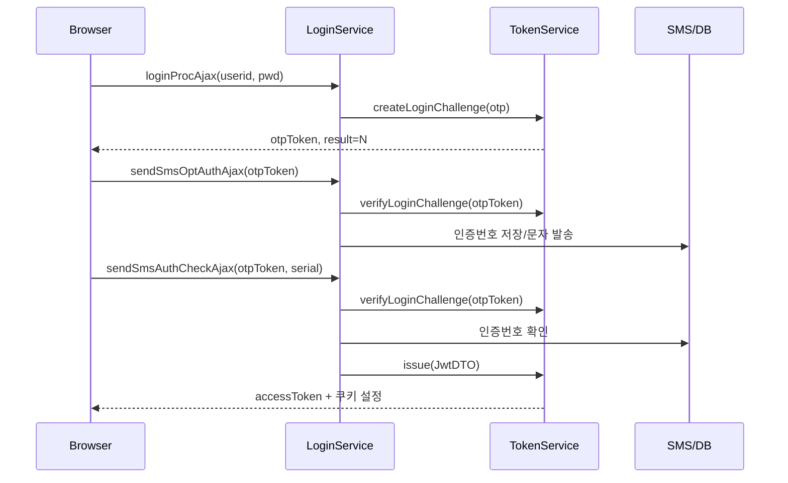

# Portal 로그인 가이드

## 1. 핵심 구조

Portal 로그인은 서버 세션에 로그인 사용자를 저장하지 않고, Spring Security가 매 요청의 JWT를 검증해 `SecurityContext`를 구성한다.

```mermaid
flowchart TD
    A[로그인 요청] --> B[LoginController]
    B --> C[LoginService.processLogin]
    C --> D{회원/조직/비밀번호 검증}
    D -->|실패| E[실패 응답]
    D -->|OTP 필요| F[Login Challenge Token 발급]
    F --> G[SMS 발송]
    G --> H[OTP 검증]
    H -->|실패| E
    H -->|성공| I[Access Token + Refresh Token 발급]
    D -->|OTP 불필요| I
    I --> J[쿠키 저장 및 응답]
    J --> K[다음 요청]
    K --> L[JwtAuthenticationFilter]
    L --> M{Access Token 검증}
    M -->|성공| N[SecurityContext 인증 객체 생성]
    M -->|만료| O[401 TOKEN_EXPIRED]
    O --> P[/auth/refresh]
    P --> Q[Refresh Rotation]
    Q --> J
```

## 2. Spring Security 역할

`SecurityConfig`는 다음 정책을 사용한다.

- `SessionCreationPolicy.STATELESS`: 로그인 사용자 정보를 HTTP session에 저장하지 않는다.
- 기본 Spring Security logout은 비활성화한다. 로그아웃은 `/auth/logout`에서 JWT와 refresh token을 직접 폐기한다.
- `JwtAuthenticationFilter`가 매 요청마다 `access_token`을 확인하고, 성공하면 `CustomUserDetails`를 `SecurityContext`에 넣는다.
- `/auth/**`는 JWT 필터를 통과하지 않는다. access token이 만료되어도 `/auth/refresh`가 실행되어야 하기 때문이다.
- 로그인, refresh, logout API는 공개 endpoint지만 실제 refresh/logout 권한은 refresh token으로 확인한다.

Access Token은 다음 순서로 찾는다.

1. `Authorization: Bearer {access_token}` 헤더
2. `access_token` HttpOnly 쿠키

## 3. 일반 로그인 흐름

### 3.1 로그인 요청

웹 로그인 endpoint:

- `POST /login/loginProcAjax`
- `POST /mobile/m/login/loginProcAjax`
- 폼 호환 endpoint: `POST /login/loginProc`

`LoginController`가 요청을 `LoginRequestDTO`로 받고 `LoginService.processLogin()`에 전달한다.

### 3.2 사용자 및 비밀번호 확인

`processLogin()`은 다음 순서로 처리한다.

1. 로그인 ID와 비밀번호 추출
2. `encYn=Y`이면 RSA로 전달된 비밀번호 복호화
3. 사용자 정보 조회
4. 조직 사용 가능 여부 조회
5. 탈퇴 여부 및 계정 잠금 여부 확인
6. 일반 계정은 로컬 비밀번호 또는 LDAP를 통해 비밀번호 인증
7. SSO 계정은 nSSO 플래그와 `sso_id`를 사용하고 일반 비밀번호 검사를 생략

비밀번호 검증이 끝났다고 바로 Access Token을 발급하지는 않는다. Portal 정책상 추가 OTP 인증이 필요한지 확인한다.

## 4. Login Challenge Token

OTP가 필요한 경우 Access Token 대신 로그인 중간 단계 전용 `otpToken`을 발급한다.

### 4.1 생성 정보

`JwtProvider.createLoginChallenge()`가 다음 정보를 담은 JWT를 만든다.

- `type`: `login-challenge`
- `purpose`: `otp`
- `sub`: 사용자 ID
- `resultUrl`: OTP 성공 후 이동할 URL
- `accountLocked`: 계정 잠금 해제를 위한 OTP인지 여부
- `requestFingerprint`: 요청 IP와 User-Agent의 해시
- `iat`, `exp`: 발급 및 만료 시각

Login Challenge Token의 유효기간은 5분이다. 이 토큰은 Access Token과 같은 서명 키를 사용하지만 `type`이 다르므로 인증된 API 호출에는 사용할 수 없다.

### 4.2 OTP 일반 로그인



1. 로그인 응답에 `result=N`, `otpToken`, `otpCnt`가 반환된다.
2. 클라이언트는 `otpToken`을 `/login/sendSmsOptAuthAjax`에 전달해 SMS 발송을 요청한다.
3. 사용자가 받은 인증번호를 `/login/sendSmsAuthCheckAjax`로 전달한다.
4. Challenge Token의 서명, 목적, 만료시간, 요청 지문을 다시 검증한다.
5. 인증번호가 맞으면 `TokenService.issue()`를 호출해 정상 로그인 토큰을 발급한다.

### 4.3 계정 잠금 해제 OTP

계정 잠금 상태에서는 `accountLocked=true`인 Challenge Token을 발급한다.

- OTP 성공 시 즉시 로그인하지 않는다.
- 로그인 실패 횟수를 초기화하고 계정 잠금을 해제한다.
- 응답 `resultCode=2`를 반환한다.
- 사용자는 비밀번호를 다시 입력해 로그인해야 하며, 이때 새로운 Access/Refresh Token이 발급된다.

## 5. Access Token

Access Token은 로그인 성공 시 `JwtProvider.createAccessToken()`으로 생성한다.

주요 claim:

```text
sub          사용자 ID
userId       사용자 ID
userNm       사용자명
orgCd        조직 코드
comp         회사 코드
role         Spring Security 권한
adminGrade   관리자 등급
type         access
iat          발급 시각
exp          발급 후 30분
```

발급 위치:

- `LoginService`의 일반 로그인 성공 처리
- OTP 인증 성공 처리
- KATE/nSSO 로그인 성공 처리
- Entra SSO 로그인 성공 처리

발급 시 Access Token은 다음 두 곳에 저장된다.

- 응답 JSON의 `accessToken`
- `access_token` HttpOnly 쿠키

쿠키 속성은 `HttpOnly`, `Secure 설정값`, `SameSite 설정값`, `Path=/`이다.

## 6. Access Token 검증

인증이 필요한 요청마다 `JwtAuthenticationFilter`가 실행된다.

1. Authorization 헤더 또는 쿠키에서 Access Token 추출
2. 서명 및 JWT 형식 검증
3. `type=access` 확인
4. 만료시간 확인
5. JWT claim으로 `JwtDTO`와 `CustomUserDetails` 생성
6. `SecurityContextHolder`에 인증 객체 저장

검증 결과:

- 정상: Controller에서 `SecurityUtil.getCurrentUserOrNull()` 등으로 현재 사용자 사용 가능
- 만료: HTTP 401, `TOKEN_EXPIRED` 반환
- 위조/잘못된 타입: HTTP 401, `INVALID_TOKEN` 반환

## 7. Refresh Token

Refresh Token은 Access Token 재발급 전용 토큰이다. 일반 API 인증에는 사용하지 않는다.

### 7.1 생성 정보

```text
sub       사용자 ID
jti       토큰 고유 ID
type      refresh
absExp    로그인 후 최대 만료 시각(24시간)
iat       발급 시각
exp       유휴 만료 시각(최대 3시간)
```

Refresh Token은 `refresh_token` HttpOnly 쿠키에 저장되며 쿠키 경로는 `/auth`이다.

### 7.2 DB 저장

Refresh Token 원문은 DB에 저장하지 않고 SHA-256 해시만 저장한다.

DB 식별 키:

- `userId`
- `tokenId(jti)`
- `token(hash)`
- `expiresAt`

따라서 동일 사용자가 여러 기기에서 로그인하면 기기별 refresh token을 별도로 관리할 수 있다.

## 8. Refresh Rotation

Access Token이 만료되면 클라이언트는 다음 API를 호출한다.

```http
POST /auth/refresh
```

처리 순서:

1. `refresh_token` 쿠키 추출
2. Refresh Token 서명, 타입, 만료시간 검증
3. `userId + jti`로 DB 레코드 조회
4. DB의 hash와 현재 토큰 hash 비교
5. 기존 refresh token 삭제
6. 동일한 절대 만료 시각을 유지한 새 Refresh Token 생성
7. 새 Access Token과 Refresh Token을 쿠키에 설정

Refresh 요청 때마다 토큰이 교체되므로 이를 Refresh Token Rotation이라고 한다.

### 재사용 감지

이미 rotation되어 삭제된 Refresh Token이 다시 사용되거나 DB hash가 일치하지 않으면 탈취 가능성으로 판단한다.

- 해당 사용자의 모든 refresh token 삭제
- 인증 쿠키 삭제
- HTTP 401 반환
- 사용자는 다시 로그인해야 한다

Refresh Token의 유휴 만료는 마지막 refresh 후 3시간이며, 절대 만료는 최초 로그인 후 24시간이다. Rotation만으로 절대 만료시간이 연장되지는 않는다.

## 9. 로그아웃

```http
POST /auth/logout
```

로그아웃은 현재 브라우저/기기의 Refresh Token만 DB에서 삭제하고 Access Token, Refresh Token, CSRF 쿠키를 만료시킨다.

앱 접속이면 `DeviceResolver.isApp(request)`를 사용해 자동 로그인 키도 만료 처리한다.

`forceLogin`은 기본 로그인 과정에서 자동 실행하지 않는다. 사용자가 중복 로그인 정리를 명시적으로 요청했을 때만 해당 사용자의 전체 Refresh Token을 폐기하고 새 토큰을 발급한다.

## 10. SSO/SAML과 토큰 발급

SAML 또는 nSSO는 외부 인증 과정의 상태값을 session에 임시 보관할 수 있지만, 로그인 완료 후 portal의 최종 인증 상태는 JWT로 만든다.

일반적인 결과는 다음과 같다.

```text
외부 SSO 인증
  → 사용자 ID/회원 정보 확인
  → LoginService 또는 SSO Controller에서 JwtDTO 생성
  → TokenService.issue()
  → Access/Refresh Token 발급
  → resultUrl 또는 nsso_return.jsp 이동
```

SSO용 중간 상태와 최종 로그인 토큰은 역할이 다르다.

- SAML session 값: 외부 인증 요청과 callback을 연결하기 위한 임시 상태
- Login Challenge Token: OTP 등 portal 로그인 중간 단계 증명
- Access Token: API/화면 요청 인증
- Refresh Token: Access Token 재발급 및 세션 유지

## 11. 토큰별 요약

| 토큰 | 용도 | 저장 위치 | 만료 | 검증 위치 |
|---|---|---|---:|---|
| Login Challenge Token | OTP/계정잠금 해제 중간 단계 | 클라이언트가 요청값으로 보관 | 5분 | `TokenService.verifyLoginChallenge()` |
| Access Token | 일반 요청 인증 | HttpOnly 쿠키 또는 Bearer 헤더 | 30분 | `JwtAuthenticationFilter` |
| Refresh Token | Access Token 재발급 | HttpOnly 쿠키(`/auth`) + DB hash | 유휴 3시간, 절대 24시간 | `TokenService.refresh()` |
| SAML session 값 | SAML 요청과 응답 연결 | HTTP session | 인증 흐름 동안 | SAML callback 처리부 |

## 12. 구현 시 주의사항

- Login Challenge Token을 Access Token처럼 API 인증에 사용하지 않는다.
- Refresh Token 원문을 DB나 로그에 남기지 않는다.
- Access Token 만료 시 재로그인보다 `/auth/refresh`를 먼저 시도한다.
- Refresh Token 재사용 감지 응답을 받은 경우 모든 세션이 폐기된 것이므로 재로그인이 필요하다.
- 토큰의 사용자 정보가 변경될 수 있으므로 Refresh 시 최신 회원 정보를 DB에서 다시 구성하는 것을 권장한다.
- `access-key`, `refresh-key`는 운영 환경에서 충분히 긴 별도 비밀키로 관리한다.
